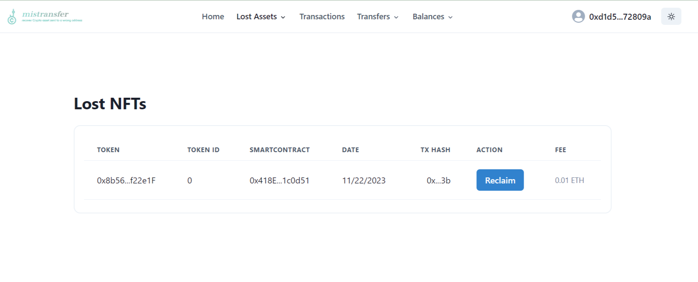

# Mistransfer

> This is a project submitted to the [Chainlink Constellation 2023 Hackathon](https://devpost.com/software/user-caring).

Did you send NFT or Token to the wrong smartcontract?

**Mistransfer** is a decentralized, automated solution to recover lost assets.
Visit the demo website on [Vercel](https://mistransfer-website-git-main-ahmetson.vercel.app/) to see how it works for the users.

The only thing required from the developers is to extend the smartcontract with `UserCaring.sol` smartcontract.


```solidity
import { UserCaring } from "mistransfer/contracts/UserCaring.sol";

contract Sample is UserCaring {
  constructor(address _userInterface) UserCaring(_userInterface) {}
}
```

Then, ask users to go to the **Mistransfer** website.

## How it works?
All other options require a centralized responsibility from the decentralized project owner.

*A developer needs to check the transaction on the explorer. Then call the function on their smartcontract.*
It's a hassle as it adds a high responsibility for the user's mistakes.

**Mistransfer** solves the developer's hassle. We host a website for the users.
The transaction to get the lost tokens is executed by the users. All the fees are paid by the users.
Not only for a transaction fee, but also to the smartcontract owner too.
No actions required from smartcontract owners.

Here is the screenshot of **Mistransfer** website where user's can reclaim back the mis-transferred NFTs.



### Is it secure?
Does any user can call withdraw function? **Nope**!

When a user clicks to **Reclaim** button by adding transaction id. 
The smartcontract verifies transaction itself. Then unlocks the tokens if it's valid.

The smartcontract checks transactions using *[Chainlink Functions](https://chain.link/functions)*.
The *Chainlink Functions* are a decentralized oracles that execute the Javascript code from the smartcontract.

The javascript code to verify the code is hardcoded into the smartcontract:

[UserInterface.sol#L51](https://github.com/ahmetson/mistransfer/blob/main/contracts/UserInterface.sol#L51).

---

# Code structure

The project consists of four parts.

The primary component is the smartcontracts which is this repository.

The javascript codes for the oracles are
in the [scripts/](./scripts/) directory in `.txt` format.

The third part is the [website](https://github.com/ahmetson/mistransfer-website) repository. 
The website is loaded as a submodule in the `website` directory.

*The fourth parameter is optional.
It converts the POST method to GET.
Chainlink Functions sometimes doesn't execute POST requests.*

*The POST-2-GET converter is stored in `app` directory. The live version hosted at https://eth-get-api-b395abe5e4a3.herokuapp.com*

## Smartcontracts

The project has two smartcontracts.

### UserInterface
The `UserInterface` is the smartcontract
that receives the transaction id. 
It's then verifies it using Chainlink Functions.

Then unlocks the tokens.

### UserCaring

`UserCaring` adds a token/NFT withdrawing functionality with a permission to
[UserInterface](#userinterface).

The `UserCaring` is intended to be used by the project owners.
Thus available as the [NPM Package](https://www.npmjs.com/package/@turkmenson/mistransfer).

```solidity
import { UserCaring } from "mistransfer/contracts/UserCaring.sol";

contract Sample is UserCaring {
  constructor(address _userInterface) UserCaring(_userInterface) {}
}
```

#### Preventing Load

Some dapps require the user assets. For example, games, bridges, or staking contracts may lock the asset.
To prevent recovering them, the `UserCaring` provides the modifiers. 
Put them in the functions that lock/burn:

```solidity
    contract UserCaring {
        constructor(address userinterface) UserCaring(userinterface) {}

        modifier intentionalNftAdd(address nft, address user, uint tokenId) {};
        modifier intentionalNftRemove(address nft, address user, uint tokenId);

        modifier intentionalTokenAdd(address token, address user, uint tokenId) {};
        modifier intentionalTokenRemove(address token, address user, uint tokenId);
    }
```

---

# Usage
Before starting, we need a Chainlink Functions Subscriptions.
Go to [New Sub](https://functions.chain.link/sepolia/new).
Remember the `subId` and paste it in the `scripts/user_interface.ts` script.

Download the user interface as a submodule.
Create `.env` from `.env.example`.

Compile the smartcontracts:

```shell
npx hardhat compile
```

Once compiled, deploy the user interface.

```shell
npx hardhat run scripts/user_interface.ts --network sepolia
```

Verify it on etherscan (optionally).

```shell
npx hardhat verify --network sepolia <address> <router> <subId> <donId>
```

Then export the abi.

```shell
npx hardhat export-abi
```

We need to add the User Interface as a consumer:

```shell
https://functions.chain.link/sepolia/<sub_id>
```

Finally, we need to set the JS code for the oracles:

```shell
npx hardhat set-js-source --network sepolia --address <user_interface> --type NFT
```

```shell
npx hardhat set-js-source --network sepolia --address <user_interface> --type ERC20
```

And it's done.